# Software Architecture Document — personal-trainer-mvp

> **Inputs:** [PRD](./PRD.md) · [CONTEXT](../../../CONTEXT.md) · [architecture-map](../../architecture-map.md) (reflects `2026702`).
> Рішення з великим масштабом удару зважували три агенти-експерти (бекенд .NET, фронтенд Telegram Mini App, алгоритм повторень і контент); автор прийняв рекомендовані варіанти (режим «автономно + експерти»).

## 1. Introduction and goals

**Intent.** Перетворити груповий Telegram-бот на персональний trainer: кожен learner проходить коротке щоденне заняття з пригадуванням польських слів у застосунку всередині Telegram (Mini App), тренер оцінює відповіді на сервері й адаптує інтервали повторень, бот нагадує про заняття, а content editor підтримує якість спільного словника через content reports (PRD §1–§2).

**Top-3 quality goals (1-liners; full scenarios in §10):**

1. **Коректність навчального обліку** — жодна відповідь не втрачається й не зараховується двічі; доба, ліміти й статуси слів рахуються в часовому поясі learner.
2. **Чутливість інтерфейсу** — «Сьогодні», оцінка відповіді й пошук укладаються в latency-цілі PRD §6.
3. **Надійність нагадувань** — не більше одного нагадування на добу без дублікатів після рестартів, ≥ 99% вчасно; рідкісна втрата при збої між надсиланням і позначкою входить у бюджет 1% (ADR-0007).

**Stakeholders.**

| Role | Interest | Sign-off owner? |
|---|---|---|
| learner | Щоденні заняття, прогрес, нагадування, пошук слів | No |
| content editor | Черга непідтверджених content reports, якість словника | No |
| Власник проєкту (Viacheslav Melnichenko) | Продуктові рішення, роль content editor у пілоті, затвердження SAD | Yes |
| Tech Lead | Архітектурна цілісність, ADR | Yes |

<!-- Decision overrides (¶4) — populated by the Step-7 critic resolution loop, empty otherwise. -->

## 2. Constraints

**Technical.**
- C# / .NET 10, ASP.NET Core з контролерами, EF Core 10.0.2 + Npgsql 10.0.0, PostgreSQL 16 — `architecture-map.md` §Stack.
- Telegram.Bot 22.8.1 (webhook), Quartz 3.15.1 з in-memory сховищем і `[DisallowConcurrentExecution]`.
- Один екземпляр застосунку (`replicas: 1`) у k8s; CI збирає образ і запускає тести, але не розгортає.
- Фронтенду й JS-тулчейну в репозиторії немає — Mini App є першим UI.

**Organisational.**
- Один розробник, переважно бекенд .NET.
- Пілот на ~50 learner стартує лише після схвалення 2 000 лем (PRD §1, OQ-2).
- Роль content editor — власник проєкту, призначений вручну (PRD OQ-3).

**Conventions.**
- DI-реєстрація в `Program.cs`, primary constructors, interface-per-service, `IOptions<T>` — `architecture-map.md` §Conventions.
- EF Core Migrations з іменами `yyyyMMddHHmmss_Name`, застосування на старті.
- Тести: xUnit + Moq + FluentAssertions; документація й коментарі українською (`AGENTS.md`).
- Свідоме відхилення від конвенції тестів: окрім InMemory-тестів сервісів, додаються інтеграційні тести на справжньому PostgreSQL (Testcontainers), бо InMemory-провайдер не перевіряє транзакції, `xmin` і захоплення рядків з пропуском заблокованих, на яких тримаються QG-1 і QG-3.

**Regulatory / external.**
- Персональні дані learner класифіковано як confidential (PRD §6.1). Окремий security review до пілоту свідомо скасовано рішенням від 2026-11-01; перевірки спираються на автоматизовані тести, залишковий ризик зафіксовано в PRD §6.1.
- Ліцензії зовнішніх даних: Wikisłownik — CC BY-SA 4.0 (атрибуція), PoliMorf і Morfeusz 2 — 2-clause BSD, VESUM — CC BY-NC-SA 4.0 (див. §11).
- Обмеження частоти запитів до Wikisłownik підтверджено пілотом (`docs/dictionary/wiktionary-validation-pilot.csv`).

## 3. Context and scope

trainer обслуговує україномовних learner, які вивчають польську, і одного content editor. Learner взаємодіє з Mini App, що відкривається в Telegram, і отримує нагадування від бота; content editor розглядає чергу content reports у тому самому Mini App. Довідкові джерела використовуються лише для звірки контенту у фоні.

**External systems (in / out):**

| Actor or system | Type | Interaction |
|---|---|---|
| learner | Person | Заняття, словник, налаштування, content reports через Mini App; нагадування й підсумки від бота |
| content editor | Person | Черга непідтверджених content reports, схвалення й відхилення змін |
| Telegram Bot API | System (external) | Webhook з оновленнями; доставка повідомлень бота; запуск Mini App з підписаними даними ідентичності |
| Wikisłownik / WSJP PAN / офіційні урядові сторінки | System (external) | Довідкові джерела для автоматичної звірки контенту (дамп і точкові запити) |

**C4 Context (L1):**

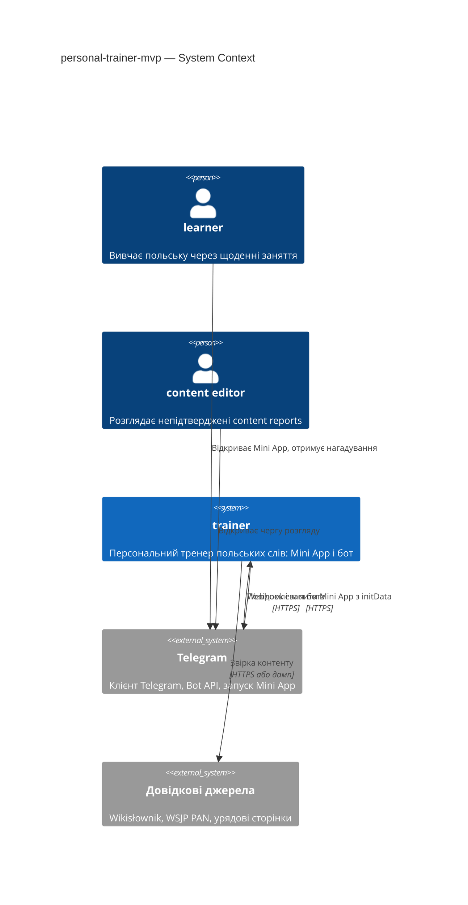
```mermaid
C4Context
    title personal-trainer-mvp — System Context

    Person(learner, "learner", "Вивчає польську через щоденні заняття")
    Person(editor, "content editor", "Розглядає непідтверджені content reports")
    System(trainer, "trainer", "Персональний тренер польських слів: Mini App і бот")
    System_Ext(telegram, "Telegram", "Клієнт Telegram, Bot API, запуск Mini App")
    System_Ext(refs, "Довідкові джерела", "Wikisłownik, WSJP PAN, урядові сторінки")

    Rel(learner, telegram, "Відкриває Mini App, отримує нагадування")
    Rel(editor, telegram, "Відкриває чергу розгляду")
    Rel(telegram, trainer, "Webhook і запити Mini App з initData", "HTTPS")
    Rel(trainer, telegram, "Повідомлення бота", "HTTPS")
    Rel(trainer, refs, "Звірка контенту", "HTTPS або дамп")
```

## 4. Solution strategy

**Target surface(s) (the first decision — what's being built):** `[backend-service, web-frontend]` — ASP.NET Core бекенд з REST JSON API і фоновими завданнями в тому самому процесі + Telegram Mini App як клієнтська SPA. Окремої `worker`-поверхні немає: нагадування, дайджести й звірка виконуються в процесі бекенду (ADR-0001).

**Top strategic choices (the seeds for ADRs):**

1. **Модульний моноліт на одному PostgreSQL** — новий код живе у feature-модулях `Identity`, `Learning`, `Content`, `Notifications`, `Bot` в одному проєкті з одним `AppDbContext`; групова модель виводиться з ужитку без міграції даних (ADR-0003, ADR-0004). Відповідь, розклад слова й стан session змінюються в одній транзакції, тож розподіл на сервіси нічого не дає при одному екземплярі.
2. **Сервер — єдине джерело істини навчального стану** — session, оцінка відповіді, межі доби й планування повторень живуть на сервері; клієнт лише відмальовує стан і результат (ADR-0008, ADR-0009). Це закриває вимоги «0 втрачених відповідей» і «рівно одне зарахування» та не розкриває правильних відповідей клієнту.
3. **Час learner як доменне поняття** — IANA-пояс learner і календарна доба з урахуванням DST моделюються явно; нагадування й дайджести йдуть через таблицю відправлень з унікальним ключем на дату (ADR-0006, ADR-0007).
4. **Словник як версійований контент у БД** — незмінні версії записів, вказівник на опубліковану версію, асинхронна звірка content reports за довідковими знімками й попередньо обчислена таблиця форм для пошуку (ADR-0010, ADR-0011, ADR-0012).
5. **UI-architecture: SPA, яку роздає бекенд** — React + TypeScript + Vite, компоненти Telegram UI kit із семантичними токенами затвердженої [дизайн-системи Everforest](./design-system.md), той самий origin, що й API; автентифікація через підписані `initData` у кожному запиті (ADR-0002, ADR-0005, ADR-0013). Дві теми мають ручний вибір; Telegram задає початкову схему до першого ручного вибору.

## 5. Building block view

Модульний моноліт: технічні папки поточного бота замінюються feature-модулями, кожен з власними контролерами, сервісами, конфігураціями EF-сутностей і методом реєстрації `Add<Module>()`; `Program.cs` лишається composition root. Модуль читає чужі дані лише через його інтерфейс; правило перевіряє архітектурний тест (ADR-0003).

**Internal decomposition:**

```
ConstantLearning/
├── Features/
│   ├── Identity/        learner, автентифікація initData, роль content editor, псевдонімна мітка
│   ├── Learning/        session, оцінка відповіді, планувальник повторень, журнал відповідей, «Сьогодні»
│   ├── Content/         записи й версії словника, імпорт, пошук, content reports, звірка, черга редактора
│   ├── Notifications/   таблиця відправлень, planner, dispatcher (нагадування, підсумки, дайджест)
│   └── Bot/             webhook, /start з кнопкою Mini App, надсилання повідомлень
├── Platform/            годинник і часові пояси, AppDbContext, Telegram-клієнт, фонові тики
├── wwwroot/             зібрана Mini App (копіюється на етапі Docker-збірки)
└── Program.cs           composition root
ConstantLearning.MiniApp/  React + TypeScript + Vite
ConstantLearning.Tests/    модульні й інтеграційні тести
```

**C4 Container (L2):**

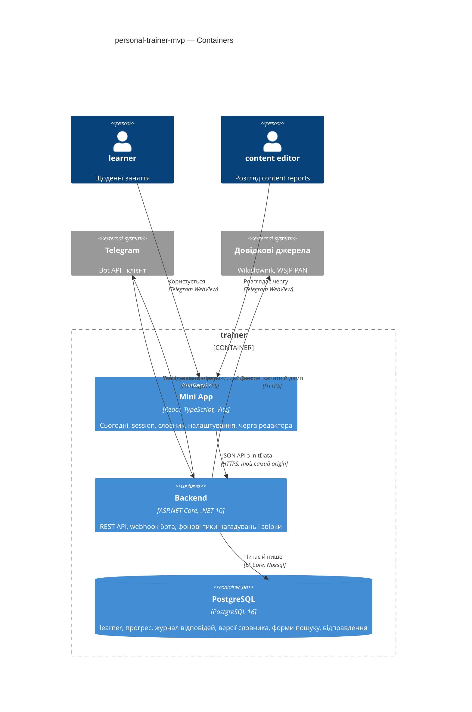
```mermaid
C4Container
    title personal-trainer-mvp — Containers

    Person(learner, "learner", "Щоденні заняття")
    Person(editor, "content editor", "Розгляд content reports")

    Container_Boundary(trainer, "trainer") {
        Container(miniapp, "Mini App", "React, TypeScript, Vite", "Сьогодні, session, словник, налаштування, черга редактора")
        Container(api, "Backend", "ASP.NET Core, .NET 10", "REST API, webhook бота, фонові тики нагадувань і звірки")
        ContainerDb(db, "PostgreSQL", "PostgreSQL 16", "learner, прогрес, журнал відповідей, версії словника, форми пошуку, відправлення")
    }

    System_Ext(telegram, "Telegram", "Bot API і клієнт")
    System_Ext(refs, "Довідкові джерела", "Wikisłownik, WSJP PAN")

    Rel(learner, miniapp, "Користується", "Telegram WebView")
    Rel(editor, miniapp, "Розглядає чергу", "Telegram WebView")
    Rel(miniapp, api, "JSON API з initData", "HTTPS, той самий origin")
    Rel(telegram, api, "Webhook оновлень", "HTTPS")
    Rel(api, telegram, "Нагадування, підсумки, дайджест", "HTTPS")
    Rel(api, db, "Читає й пише", "EF Core, Npgsql")
    Rel(api, refs, "Точкові запити й дамп", "HTTPS")
```

## 6. Runtime view

**Critical flow 1: відповідь на вправу пригадування (AC-12, AC-15–AC-18)**

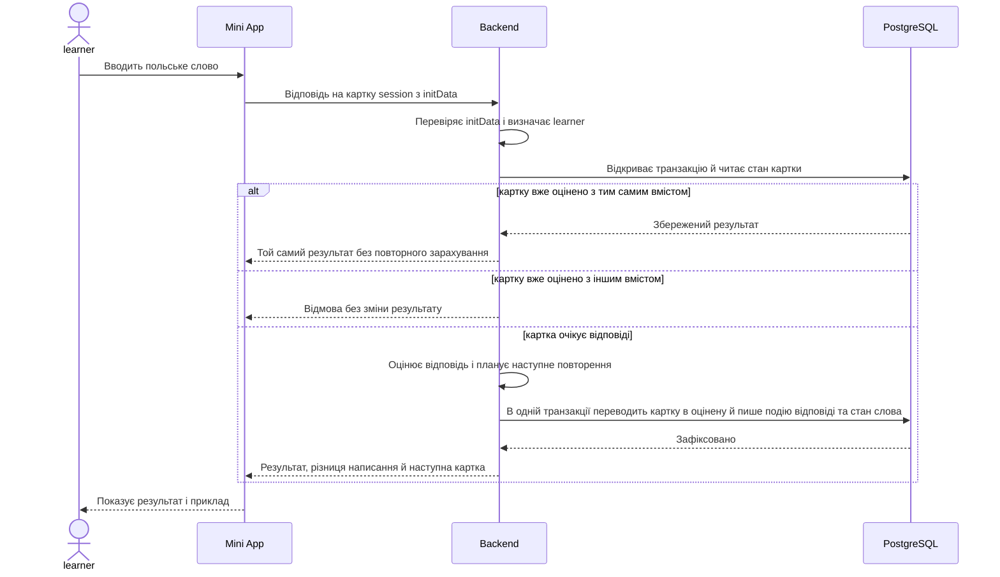
```mermaid
sequenceDiagram
    actor L as learner
    participant M as Mini App
    participant A as Backend
    participant D as PostgreSQL
    L->>M: Вводить польське слово
    M->>A: Відповідь на картку session з initData
    A->>A: Перевіряє initData і визначає learner
    A->>D: Відкриває транзакцію й читає стан картки
    alt картку вже оцінено з тим самим вмістом
        D-->>A: Збережений результат
        A-->>M: Той самий результат без повторного зарахування
    else картку вже оцінено з іншим вмістом
        A-->>M: Відмова без зміни результату
    else картка очікує відповіді
        A->>A: Оцінює відповідь і планує наступне повторення
        A->>D: В одній транзакції переводить картку в оцінену й пише подію відповіді та стан слова
        D-->>A: Зафіксовано
        A-->>M: Результат, різниця написання й наступна картка
    end
    M-->>L: Показує результат і приклад
```

**Critical flow 2: щоденне нагадування (AC-26)**

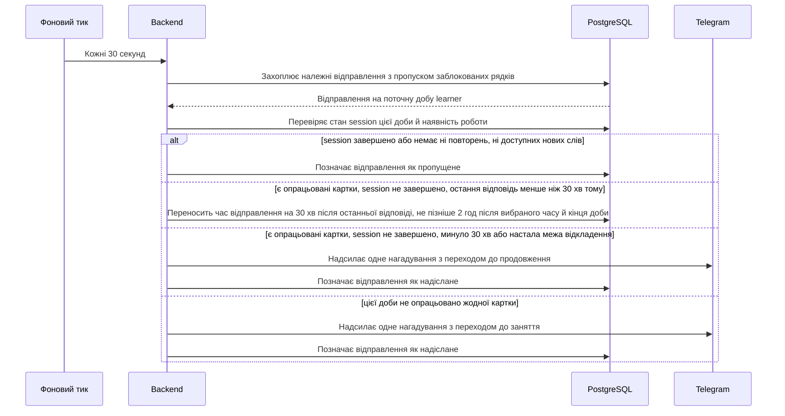
```mermaid
sequenceDiagram
    participant T as Фоновий тик
    participant A as Backend
    participant D as PostgreSQL
    participant G as Telegram
    T->>A: Кожні 30 секунд
    A->>D: Захоплює належні відправлення з пропуском заблокованих рядків
    D-->>A: Відправлення на поточну добу learner
    A->>D: Перевіряє стан session цієї доби й наявність роботи
    alt session завершено або немає ні повторень, ні доступних нових слів
        A->>D: Позначає відправлення як пропущене
    else є опрацьовані картки, session не завершено, остання відповідь менше ніж 30 хв тому
        A->>D: Переносить час відправлення на 30 хв після останньої відповіді, не пізніше 2 год після вибраного часу й кінця доби
    else є опрацьовані картки, session не завершено, минуло 30 хв або настала межа відкладення
        A->>G: Надсилає одне нагадування з переходом до продовження
        A->>D: Позначає відправлення як надіслане
    else цієї доби не опрацьовано жодної картки
        A->>G: Надсилає одне нагадування з переходом до заняття
        A->>D: Позначає відправлення як надіслане
    end
```

Решту критичних потоків описано нижче з загальними учасниками.

### Онбординг learner

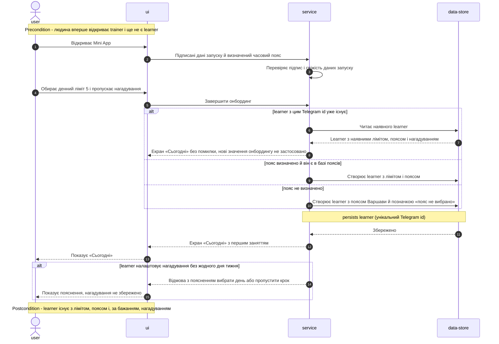
```mermaid
sequenceDiagram
    autonumber
    actor U as user
    participant UI as ui
    participant S as service
    participant D as data-store

    Note over U,UI: Precondition - людина вперше відкриває trainer і ще не є learner
    U->>UI: Відкриває Mini App
    UI->>S: Підписані дані запуску й визначений часовий пояс
    S->>S: Перевіряє підпис і свіжість даних запуску
    U->>UI: Обирає денний ліміт 5 і пропускає нагадування
    UI->>S: Завершити онбординг
    alt learner з цим Telegram id уже існує
        S->>D: Читає наявного learner
        D-->>S: Learner з наявними лімітом, поясом і нагадуванням
        S-->>UI: Екран «Сьогодні» без помилки, нові значення онбордингу не застосовано
    else пояс визначено й він є в базі поясів
        S->>D: Створює learner з лімітом і поясом
    else пояс не визначено
        S->>D: Створює learner з поясом Варшави й позначкою «пояс не вибрано»
    end
    Note over S,D: persists learner (унікальний Telegram id)
    D-->>S: Збережено
    S-->>UI: Екран «Сьогодні» з першим заняттям
    UI-->>U: Показує «Сьогодні»
    alt learner налаштовує нагадування без жодного дня тижня
        S-->>UI: Відмова з поясненням вибрати день або пропустити крок
        UI-->>U: Показує пояснення, нагадування не збережено
    end
    Note over U,UI: Postcondition - learner існує з лімітом, поясом і, за бажанням, нагадуванням
```

### Складання session

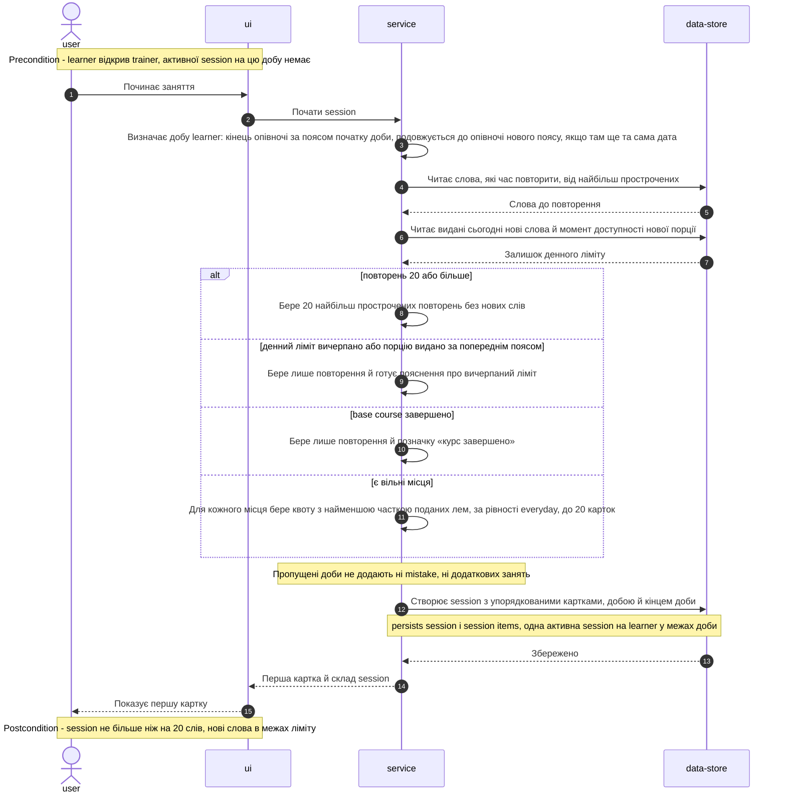
```mermaid
sequenceDiagram
    autonumber
    actor U as user
    participant UI as ui
    participant S as service
    participant D as data-store

    Note over U,UI: Precondition - learner відкрив trainer, активної session на цю добу немає
    U->>UI: Починає заняття
    UI->>S: Почати session
    S->>S: Визначає добу learner: кінець опівночі за поясом початку доби, подовжується до опівночі нового поясу, якщо там ще та сама дата
    S->>D: Читає слова, які час повторити, від найбільш прострочених
    D-->>S: Слова до повторення
    S->>D: Читає видані сьогодні нові слова й момент доступності нової порції
    D-->>S: Залишок денного ліміту
    alt повторень 20 або більше
        S->>S: Бере 20 найбільш прострочених повторень без нових слів
    else денний ліміт вичерпано або порцію видано за попереднім поясом
        S->>S: Бере лише повторення й готує пояснення про вичерпаний ліміт
    else base course завершено
        S->>S: Бере лише повторення й позначку «курс завершено»
    else є вільні місця
        S->>S: Для кожного місця бере квоту з найменшою часткою поданих лем, за рівності everyday, до 20 карток
    end
    Note over S: Пропущені доби не додають ні mistake, ні додаткових занять
    S->>D: Створює session з упорядкованими картками, добою й кінцем доби
    Note over S,D: persists session і session items, одна активна session на learner у межах доби
    D-->>S: Збережено
    S-->>UI: Перша картка й склад session
    UI-->>U: Показує першу картку
    Note over U,UI: Postcondition - session не більше ніж на 20 слів, нові слова в межах ліміту
```

### Картка нового слова й «Вже знаю»

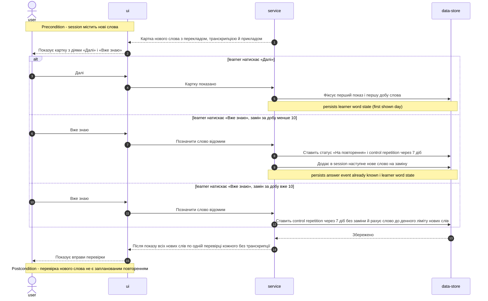
```mermaid
sequenceDiagram
    autonumber
    actor U as user
    participant UI as ui
    participant S as service
    participant D as data-store

    Note over U,UI: Precondition - session містить нові слова
    S-->>UI: Картка нового слова з перекладом, транскрипцією й прикладом
    UI-->>U: Показує картку з діями «Далі» і «Вже знаю»
    alt learner натискає «Далі»
        U->>UI: Далі
        UI->>S: Картку показано
        S->>D: Фіксує перший показ і першу добу слова
        Note over S,D: persists learner word state (first shown day)
    else learner натискає «Вже знаю», замін за добу менше 10
        U->>UI: Вже знаю
        UI->>S: Позначити слово відомим
        S->>D: Ставить статус «На повторення» і control repetition через 7 діб
        S->>D: Додає в session наступне нове слово на заміну
        Note over S,D: persists answer event already known і learner word state
    else learner натискає «Вже знаю», замін за добу вже 10
        U->>UI: Вже знаю
        UI->>S: Позначити слово відомим
        S->>D: Ставить control repetition через 7 діб без заміни й рахує слово до денного ліміту нових слів
    end
    D-->>S: Збережено
    S-->>UI: Після показу всіх нових слів по одній перевірці кожного без транскрипції
    UI-->>U: Показує вправи перевірки
    Note over U,UI: Postcondition - перевірка нового слова не є запланованим повторенням
```

### Оцінка відповіді й статус слова

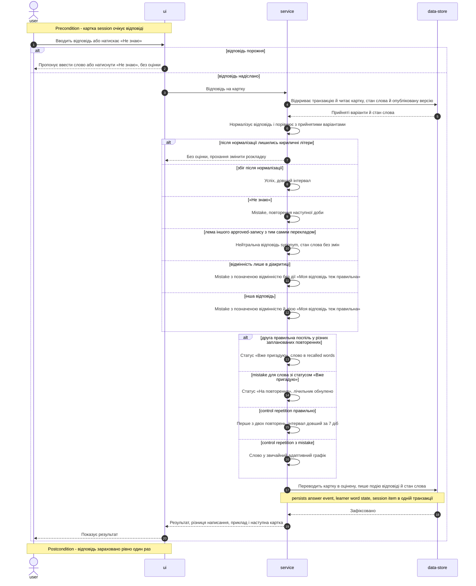
```mermaid
sequenceDiagram
    autonumber
    actor U as user
    participant UI as ui
    participant S as service
    participant D as data-store

    Note over U,UI: Precondition - картка session очікує відповіді
    U->>UI: Вводить відповідь або натискає «Не знаю»
    alt відповідь порожня
        UI-->>U: Пропонує ввести слово або натиснути «Не знаю», без оцінки
    else відповідь надіслано
        UI->>S: Відповідь на картку
        S->>D: Відкриває транзакцію й читає картку, стан слова й опубліковану версію
        D-->>S: Прийняті варіанти й стан слова
        S->>S: Нормалізує відповідь і порівнює з прийнятими варіантами
        alt після нормалізації лишились кириличні літери
            S-->>UI: Без оцінки, прохання змінити розкладку
        else збіг після нормалізації
            S->>S: Успіх, довший інтервал
        else «Не знаю»
            S->>S: Mistake, повторення наступної доби
        else лема іншого approved-запису з тим самим перекладом
            S->>S: Нейтральна відповідь synonym, стан слова без змін
        else відмінність лише в діакритиці
            S->>S: Mistake з позначеною відмінністю без дії «Моя відповідь теж правильна»
        else інша відповідь
            S->>S: Mistake з позначеною відмінністю й дією «Моя відповідь теж правильна»
        end
        alt друга правильна поспіль у різних запланованих повтореннях
            S->>S: Статус «Вже пригадую», слово в recalled words
        else mistake для слова зі статусом «Вже пригадую»
            S->>S: Статус «На повторення», лічильник обнулено
        else control repetition правильно
            S->>S: Перше з двох повторень, інтервал довший за 7 діб
        else control repetition з mistake
            S->>S: Слово у звичайний адаптивний графік
        end
        S->>D: Переводить картку в оцінену, пише подію відповіді й стан слова
        Note over S,D: persists answer event, learner word state, session item в одній транзакції
        D-->>S: Зафіксовано
        S-->>UI: Результат, різниця написання, приклад і наступна картка
        UI-->>U: Показує результат
    end
    Note over U,UI: Postcondition - відповідь зараховано рівно один раз
```

### «Моя відповідь теж правильна»

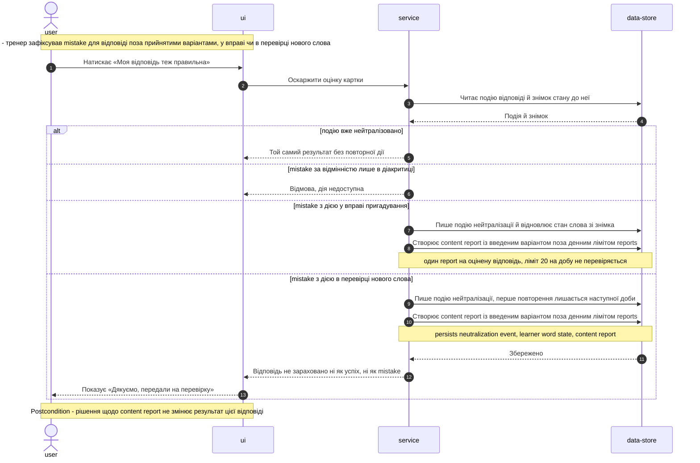
```mermaid
sequenceDiagram
    autonumber
    actor U as user
    participant UI as ui
    participant S as service
    participant D as data-store

    Note over U,UI: Precondition - тренер зафіксував mistake для відповіді поза прийнятими варіантами, у вправі чи в перевірці нового слова
    U->>UI: Натискає «Моя відповідь теж правильна»
    UI->>S: Оскаржити оцінку картки
    S->>D: Читає подію відповіді й знімок стану до неї
    D-->>S: Подія й знімок
    alt подію вже нейтралізовано
        S-->>UI: Той самий результат без повторної дії
    else mistake за відмінністю лише в діакритиці
        S-->>UI: Відмова, дія недоступна
    else mistake з дією у вправі пригадування
        S->>D: Пише подію нейтралізації й відновлює стан слова зі знімка
        S->>D: Створює content report із введеним варіантом поза денним лімітом reports
        Note over S,D: один report на оцінену відповідь, ліміт 20 на добу не перевіряється
    else mistake з дією в перевірці нового слова
        S->>D: Пише подію нейтралізації, перше повторення лишається наступної доби
        S->>D: Створює content report із введеним варіантом поза денним лімітом reports
        Note over S,D: persists neutralization event, learner word state, content report
        D-->>S: Збережено
        S-->>UI: Відповідь не зараховано ні як успіх, ні як mistake
        UI-->>U: Показує «Дякуємо, передали на перевірку»
    end
    Note over U,UI: Postcondition - рішення щодо content report не змінює результат цієї відповіді
```

### Продовження session і межа доби

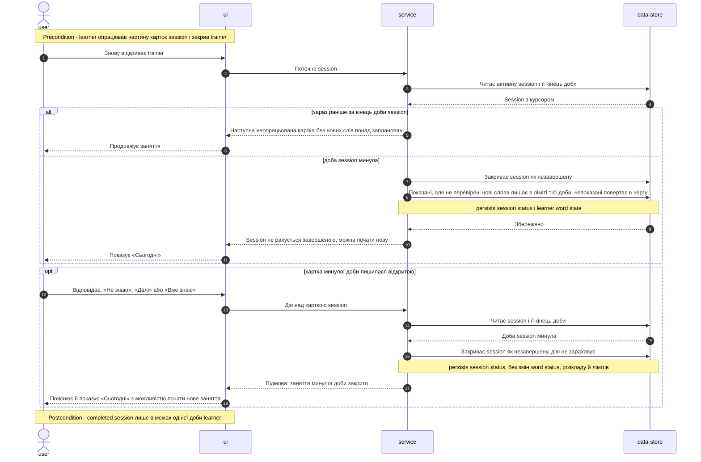
```mermaid
sequenceDiagram
    autonumber
    actor U as user
    participant UI as ui
    participant S as service
    participant D as data-store

    Note over U,UI: Precondition - learner опрацював частину карток session і закрив trainer
    U->>UI: Знову відкриває trainer
    UI->>S: Поточна session
    S->>D: Читає активну session і її кінець доби
    D-->>S: Session з курсором
    alt зараз раніше за кінець доби session
        S-->>UI: Наступна неопрацьована картка без нових слів понад заплановані
        UI-->>U: Продовжує заняття
    else доба session минула
        S->>D: Закриває session як незавершену
        S->>D: Показані, але не перевірені нові слова лишає в ліміті тієї доби, непоказані повертає в чергу
        Note over S,D: persists session status і learner word state
        D-->>S: Збережено
        S-->>UI: Session не рахується завершеною, можна почати нову
        UI-->>U: Показує «Сьогодні»
    end
    opt картка минулої доби лишилася відкритою
        U->>UI: Відповідає, «Не знаю», «Далі» або «Вже знаю»
        UI->>S: Дія над карткою session
        S->>D: Читає session і її кінець доби
        D-->>S: Доба session минула
        S->>D: Закриває session як незавершену, дію не зараховує
        Note over S,D: persists session status, без змін word status, розкладу й лімітів
        S-->>UI: Відмова: заняття минулої доби закрито
        UI-->>U: Пояснює й показує «Сьогодні» з можливістю почати нове заняття
    end
    Note over U,UI: Postcondition - completed session лише в межах однієї доби learner
```

### Налаштування темпу, поясу й нагадувань

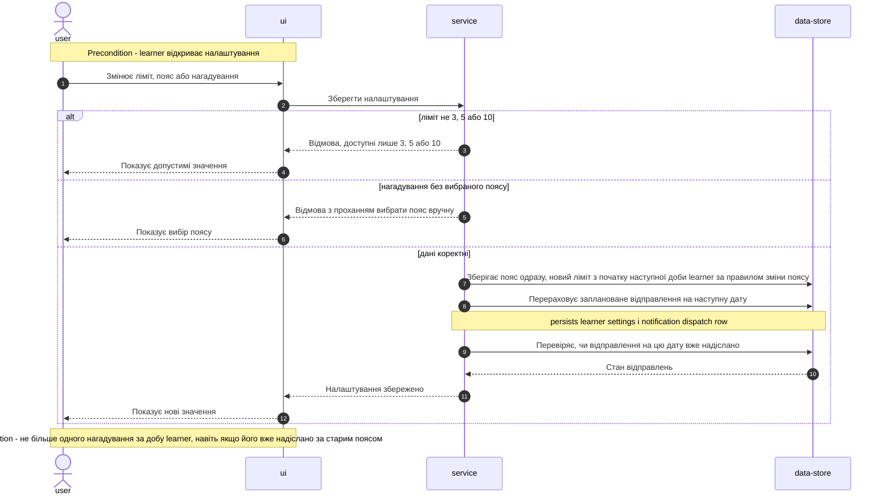
```mermaid
sequenceDiagram
    autonumber
    actor U as user
    participant UI as ui
    participant S as service
    participant D as data-store

    Note over U,UI: Precondition - learner відкриває налаштування
    U->>UI: Змінює ліміт, пояс або нагадування
    UI->>S: Зберегти налаштування
    alt ліміт не 3, 5 або 10
        S-->>UI: Відмова, доступні лише 3, 5 або 10
        UI-->>U: Показує допустимі значення
    else нагадування без вибраного поясу
        S-->>UI: Відмова з проханням вибрати пояс вручну
        UI-->>U: Показує вибір поясу
    else дані коректні
        S->>D: Зберігає пояс одразу, новий ліміт з початку наступної доби learner за правилом зміни поясу
        S->>D: Перераховує заплановане відправлення на наступну дату
        Note over S,D: persists learner settings і notification dispatch row
        S->>D: Перевіряє, чи відправлення на цю дату вже надіслано
        D-->>S: Стан відправлень
        S-->>UI: Налаштування збережено
        UI-->>U: Показує нові значення
    end
    Note over U,UI: Postcondition - не більше одного нагадування за добу learner, навіть якщо його вже надіслано за старим поясом
```

### Екран «Сьогодні»

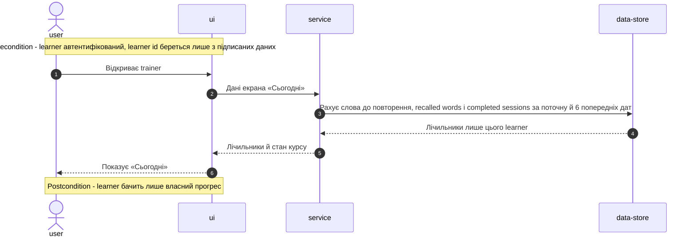
```mermaid
sequenceDiagram
    autonumber
    actor U as user
    participant UI as ui
    participant S as service
    participant D as data-store

    Note over U,UI: Precondition - learner автентифікований, learner id береться лише з підписаних даних
    U->>UI: Відкриває trainer
    UI->>S: Дані екрана «Сьогодні»
    S->>D: Рахує слова до повторення, recalled words і completed sessions за поточну й 6 попередніх дат
    D-->>S: Лічильники лише цього learner
    S-->>UI: Лічильники й стан курсу
    UI-->>U: Показує «Сьогодні»
    Note over U,UI: Postcondition - learner бачить лише власний прогрес
```

### Пошук у словнику

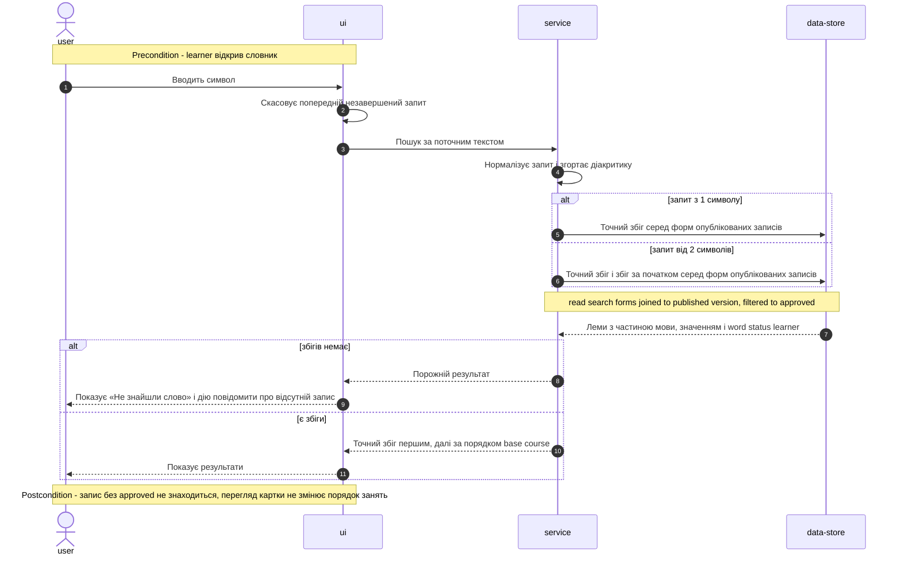
```mermaid
sequenceDiagram
    autonumber
    actor U as user
    participant UI as ui
    participant S as service
    participant D as data-store

    Note over U,UI: Precondition - learner відкрив словник
    U->>UI: Вводить символ
    UI->>UI: Скасовує попередній незавершений запит
    UI->>S: Пошук за поточним текстом
    S->>S: Нормалізує запит і згортає діакритику
    alt запит з 1 символу
        S->>D: Точний збіг серед форм опублікованих записів
    else запит від 2 символів
        S->>D: Точний збіг і збіг за початком серед форм опублікованих записів
    end
    Note over S,D: read search forms joined to published version, filtered to approved
    D-->>S: Леми з частиною мови, значенням і word status learner
    alt збігів немає
        S-->>UI: Порожній результат
        UI-->>U: Показує «Не знайшли слово» і дію повідомити про відсутній запис
    else є збіги
        S-->>UI: Точний збіг першим, далі за порядком base course
        UI-->>U: Показує результати
    end
    Note over U,UI: Postcondition - запис без approved не знаходиться, перегляд картки не змінює порядок занять
```

### Content report і автоматична звірка

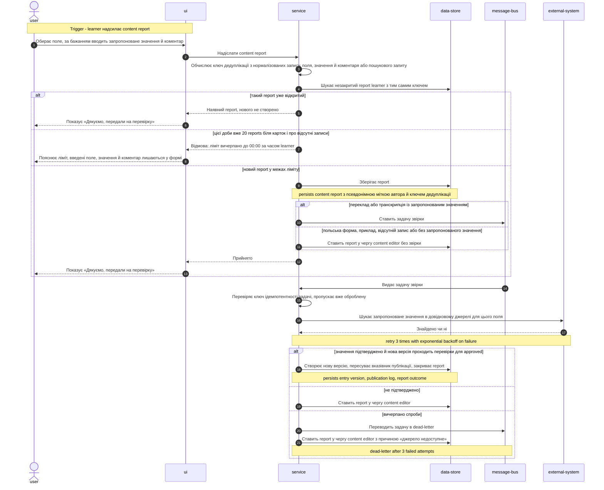
```mermaid
sequenceDiagram
    autonumber
    actor U as user
    participant UI as ui
    participant S as service
    participant D as data-store
    participant B as message-bus
    participant X as external-system

    Note over U,UI: Trigger - learner надсилає content report
    U->>UI: Обирає поле, за бажанням вводить запропоноване значення й коментар
    UI->>S: Надіслати content report
    S->>S: Обчислює ключ дедуплікації з нормалізованих запису, поля, значення й коментаря або пошукового запиту
    S->>D: Шукає незакритий report learner з тим самим ключем
    alt такий report уже відкритий
        S-->>UI: Наявний report, нового не створено
        UI-->>U: Показує «Дякуємо, передали на перевірку»
    else цієї доби вже 20 reports біля карток і про відсутні записи
        S-->>UI: Відмова: ліміт вичерпано до 00:00 за часом learner
        UI-->>U: Пояснює ліміт, введені поле, значення й коментар лишаються у формі
    else новий report у межах ліміту
        S->>D: Зберігає report
        Note over S,D: persists content report з псевдонімною міткою автора й ключем дедуплікації
        alt переклад або транскрипція із запропонованим значенням
            S->>B: Ставить задачу звірки
        else польська форма, приклад, відсутній запис або без запропонованого значення
            S->>D: Ставить report у чергу content editor без звірки
        end
        S-->>UI: Прийнято
        UI-->>U: Показує «Дякуємо, передали на перевірку»
    end
    B->>S: Видає задачу звірки
    S->>S: Перевіряє ключ ідемпотентності задачі, пропускає вже оброблену
    S->>X: Шукає запропоноване значення в довідковому джерелі для цього поля
    X-->>S: Знайдено чи ні
    Note over S,X: retry 3 times with exponential backoff on failure
    alt значення підтверджено й нова версія проходить перевірки для approved
        S->>D: Створює нову версію, пересуває вказівник публікації, закриває report
        Note over S,D: persists entry version, publication log, report outcome
    else не підтверджено
        S->>D: Ставить report у чергу content editor
    else вичерпано спроби
        S->>B: Переводить задачу в dead-letter
        S->>D: Ставить report у чергу content editor з причиною «джерело недоступне»
        Note over S,B: dead-letter after 3 failed attempts
    end
```

### Щоденні підсумки й дайджест

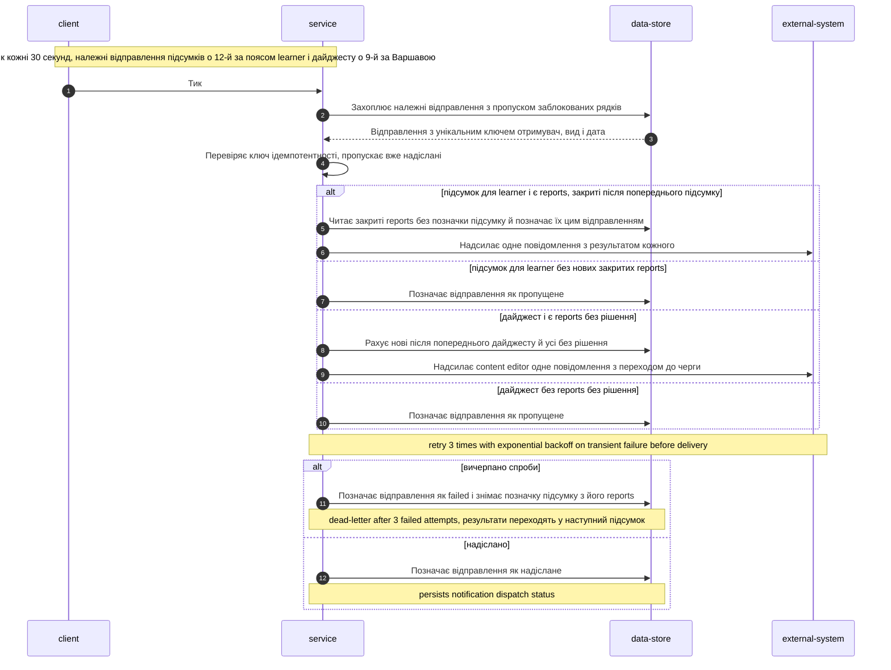
```mermaid
sequenceDiagram
    autonumber
    participant C as client
    participant S as service
    participant D as data-store
    participant X as external-system

    Note over C,S: Trigger - тик кожні 30 секунд, належні відправлення підсумків о 12-й за поясом learner і дайджесту о 9-й за Варшавою
    C->>S: Тик
    S->>D: Захоплює належні відправлення з пропуском заблокованих рядків
    D-->>S: Відправлення з унікальним ключем отримувач, вид і дата
    S->>S: Перевіряє ключ ідемпотентності, пропускає вже надіслані
    alt підсумок для learner і є reports, закриті після попереднього підсумку
        S->>D: Читає закриті reports без позначки підсумку й позначає їх цим відправленням
        S->>X: Надсилає одне повідомлення з результатом кожного
    else підсумок для learner без нових закритих reports
        S->>D: Позначає відправлення як пропущене
    else дайджест і є reports без рішення
        S->>D: Рахує нові після попереднього дайджесту й усі без рішення
        S->>X: Надсилає content editor одне повідомлення з переходом до черги
    else дайджест без reports без рішення
        S->>D: Позначає відправлення як пропущене
    end
    Note over S,X: retry 3 times with exponential backoff on transient failure before delivery
    alt вичерпано спроби
        S->>D: Позначає відправлення як failed і знімає позначку підсумку з його reports
        Note over S,D: dead-letter after 3 failed attempts, результати переходять у наступний підсумок
    else надіслано
        S->>D: Позначає відправлення як надіслане
        Note over S,D: persists notification dispatch status
    end
```

### Розгляд черги content editor

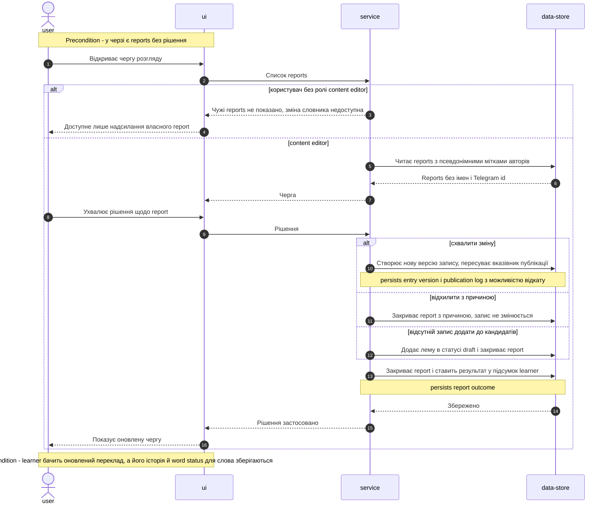
```mermaid
sequenceDiagram
    autonumber
    actor U as user
    participant UI as ui
    participant S as service
    participant D as data-store

    Note over U,UI: Precondition - у черзі є reports без рішення
    U->>UI: Відкриває чергу розгляду
    UI->>S: Список reports
    alt користувач без ролі content editor
        S-->>UI: Чужі reports не показано, зміна словника недоступна
        UI-->>U: Доступне лише надсилання власного report
    else content editor
        S->>D: Читає reports з псевдонімними мітками авторів
        D-->>S: Reports без імен і Telegram id
        S-->>UI: Черга
        U->>UI: Ухвалює рішення щодо report
        UI->>S: Рішення
        alt схвалити зміну
            S->>D: Створює нову версію запису, пересуває вказівник публікації
            Note over S,D: persists entry version і publication log з можливістю відкату
        else відхилити з причиною
            S->>D: Закриває report з причиною, запис не змінюється
        else відсутній запис додати до кандидатів
            S->>D: Додає лему в статусі draft і закриває report
        end
        S->>D: Закриває report і ставить результат у підсумок learner
        Note over S,D: persists report outcome
        D-->>S: Збережено
        S-->>UI: Рішення застосовано
        UI-->>U: Показує оновлену чергу
    end
    Note over U,UI: Postcondition - learner бачить оновлений переклад, а його історія й word status для слова зберігаються
```

### Відкат застосованої зміни словника

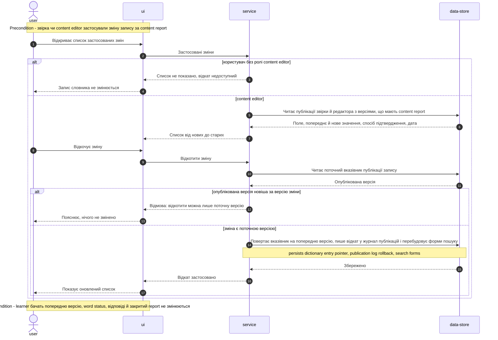
```mermaid
sequenceDiagram
    autonumber
    actor U as user
    participant UI as ui
    participant S as service
    participant D as data-store

    Note over U,UI: Precondition - звірка чи content editor застосували зміну запису за content report
    U->>UI: Відкриває список застосованих змін
    UI->>S: Застосовані зміни
    alt користувач без ролі content editor
        S-->>UI: Список не показано, відкат недоступний
        UI-->>U: Запис словника не змінюється
    else content editor
        S->>D: Читає публікації звірки й редактора з версіями, що мають content report
        D-->>S: Поле, попереднє й нове значення, спосіб підтвердження, дата
        S-->>UI: Список від нових до старих
        U->>UI: Відкочує зміну
        UI->>S: Відкотити зміну
        S->>D: Читає поточний вказівник публікації запису
        D-->>S: Опублікована версія
        alt опублікована версія новіша за версію зміни
            S-->>UI: Відмова: відкотити можна лише поточну версію
            UI-->>U: Пояснює, нічого не змінено
        else зміна є поточною версією
            S->>D: Повертає вказівник на попередню версію, пише відкат у журнал публікацій і перебудовує форми пошуку
            Note over S,D: persists dictionary entry pointer, publication log rollback, search forms
            D-->>S: Збережено
            S-->>UI: Відкат застосовано
            UI-->>U: Показує оновлений список
        end
    end
    Note over U,UI: Postcondition - learner бачать попередню версію, word status, відповіді й закритий report не змінюються
```

### Coverage: US/AC → flows

| ID | Realized by (§6 heading) | How | Note |
|---|---|---|---|
| US-01 | `Онбординг learner` | flow | |
| US-02 | `Складання session`, `Картка нового слова й «Вже знаю»` | flow | |
| US-03 | `Оцінка відповіді й статус слова`, `Critical flow 1: відповідь на вправу пригадування`, `«Моя відповідь теж правильна»` | flow | |
| US-04 | `Картка нового слова й «Вже знаю»`, `Оцінка відповіді й статус слова` | flow | |
| US-05 | `Продовження session і межа доби` | flow | |
| US-06 | `Critical flow 2: щоденне нагадування`, `Налаштування темпу, поясу й нагадувань` | flow | |
| US-07 | `Екран «Сьогодні»` | flow | |
| US-08 | `Пошук у словнику` | flow | |
| US-09 | `Content report і автоматична звірка`, `Щоденні підсумки й дайджест` | flow | |
| US-10 | `Розгляд черги content editor`, `Щоденні підсумки й дайджест` | flow | |
| US-11 | `Налаштування темпу, поясу й нагадувань`, `Складання session` | flow | |
| US-12 | `Відкат застосованої зміни словника` | flow | |
| AC-01 | `Онбординг learner` | flow | |
| AC-02 | `Онбординг learner` | branch | `alt learner налаштовує нагадування без жодного дня тижня` |
| AC-03 | `Складання session` | flow | |
| AC-04 | `Складання session` | branch | `alt повторень 20 або більше` |
| AC-05 | `Складання session` | branch | `else є вільні місця` |
| AC-06 | `Складання session` | branch | `else денний ліміт вичерпано або порцію видано за попереднім поясом` |
| AC-07 | `Складання session` | branch | `else денний ліміт вичерпано або порцію видано за попереднім поясом` + визначення доби learner |
| AC-08 | `Складання session` | branch | `alt повторень 20 або більше` + нотатка про пропущені доби |
| AC-09 | `Складання session` | branch | `else є вільні місця` (квота з найменшою часткою поданих лем) |
| AC-10 | `Складання session` | branch | `else base course завершено` |
| AC-11 | `Картка нового слова й «Вже знаю»` | flow | |
| AC-12 | `Оцінка відповіді й статус слова` | branch | `alt збіг після нормалізації` |
| AC-13 | `Оцінка відповіді й статус слова` | branch | `alt відповідь порожня` |
| AC-14 | `Оцінка відповіді й статус слова` | branch | `else «Не знаю»` |
| AC-15 | `Оцінка відповіді й статус слова` | branch | `else відмінність лише в діакритиці` |
| AC-16 | `Оцінка відповіді й статус слова` | branch | `else інша відповідь` |
| AC-17 | `«Моя відповідь теж правильна»` | flow | |
| AC-18 | `Оцінка відповіді й статус слова` | branch | `alt друга правильна поспіль у різних запланованих повтореннях` |
| AC-19 | `Оцінка відповіді й статус слова` | branch | `else mistake для слова зі статусом «Вже пригадую»` |
| AC-20 | `Картка нового слова й «Вже знаю»` | branch | `else learner натискає «Вже знаю», замін за добу менше 10` |
| AC-21 | `Картка нового слова й «Вже знаю»` | branch | `else learner натискає «Вже знаю», замін за добу вже 10` (слово рахується до ліміту) |
| AC-22 | `Оцінка відповіді й статус слова` | branch | `else control repetition з mistake` |
| AC-23 | `Оцінка відповіді й статус слова` | branch | `else control repetition правильно` |
| AC-24 | `Продовження session і межа доби` | branch | `alt зараз раніше за кінець доби session` |
| AC-25 | `Продовження session і межа доби` | branch | `else доба session минула` |
| AC-26 | `Critical flow 2: щоденне нагадування` | flow | пропуск, відкладення на 30 хв і два види нагадування |
| AC-27 | `Налаштування темпу, поясу й нагадувань` | branch | `else нагадування без вибраного поясу` |
| AC-28 | `Екран «Сьогодні»` | flow | |
| AC-29 | — | N/A | learner id береться лише з перевірених підписаних даних запуску, тож запит до чужого прогресу неможливо сформувати — забезпечує автентифікація (ADR-0005), не runtime-гілка |
| AC-30 | `Пошук у словнику` | flow | |
| AC-31 | `Пошук у словнику` | branch | `alt збігів немає` |
| AC-32 | `Пошук у словнику`, `Складання session` | flow | фільтр лише за опублікованими `approved`-версіями |
| AC-33 | `Пошук у словнику` | flow | постумова: запис без approved не знаходиться (вказівник публікації знято) |
| AC-34 | `Content report і автоматична звірка` | flow | |
| AC-35 | `Content report і автоматична звірка` | branch | `alt значення підтверджено й нова версія проходить перевірки для approved` |
| AC-36 | `Content report і автоматична звірка` | branch | `else польська форма, приклад, відсутній запис або без запропонованого значення` |
| AC-37 | `Щоденні підсумки й дайджест` | branch | `alt підсумок для learner і є reports, закриті після попереднього підсумку` |
| AC-38 | `Розгляд черги content editor` | branch | `alt схвалити зміну` |
| AC-39 | `Розгляд черги content editor` | branch | `else відхилити з причиною` |
| AC-40 | `Розгляд черги content editor` | branch | `else відсутній запис додати до кандидатів` |
| AC-41 | `Розгляд черги content editor` | branch | `alt користувач без ролі content editor` |
| AC-42 | `Розгляд черги content editor`, `Оцінка відповіді й статус слова` | flow | постумова черги + читання опублікованої версії під час оцінки |
| AC-43 | `Щоденні підсумки й дайджест` | branch | `else дайджест і є reports без рішення` |
| AC-44 | `Налаштування темпу, поясу й нагадувань` | branch | `else дані коректні` |
| AC-45 | `Налаштування темпу, поясу й нагадувань` | branch | `alt ліміт не 3, 5 або 10` |
| AC-46 | `Content report і автоматична звірка` | branch | `else цієї доби вже 20 reports біля карток і про відсутні записи` |
| AC-47 | `«Моя відповідь теж правильна»` | branch | `else mistake з дією у вправі пригадування` (поза денним лімітом) |
| AC-48 | `Відкат застосованої зміни словника` | branch | `else зміна є поточною версією` |
| AC-49 | `Відкат застосованої зміни словника` | branch | `alt опублікована версія новіша за версію зміни` |
| AC-50 | `Відкат застосованої зміни словника` | branch | `alt користувач без ролі content editor` |
| AC-51 | `Content report і автоматична звірка` | branch | `alt такий report уже відкритий` |
| AC-52 | `Продовження session і межа доби` | branch | `opt картка минулої доби лишилася відкритою` |
| AC-53 | `Онбординг learner` | branch | `alt learner з цим Telegram id уже існує` |
| AC-54 | `Складання session` | branch | `else денний ліміт вичерпано або порцію видано за попереднім поясом` + визначення доби learner |
| AC-55 | `«Моя відповідь теж правильна»` | branch | `else mistake з дією в перевірці нового слова` |
| AC-56 | `Оцінка відповіді й статус слова` | branch | `else лема іншого approved-запису з тим самим перекладом` |
| AC-57 | `Оцінка відповіді й статус слова` | branch | `alt після нормалізації лишились кириличні літери` |
| AC-58 | `Вибір теми Mini App` | flow | локальна тема, ручний вибір, повторне відкриття та fallback |

Coverage: 12/12 user stories · 58/58 ACs — 1 non-runtime N/A.

### Вибір теми Mini App

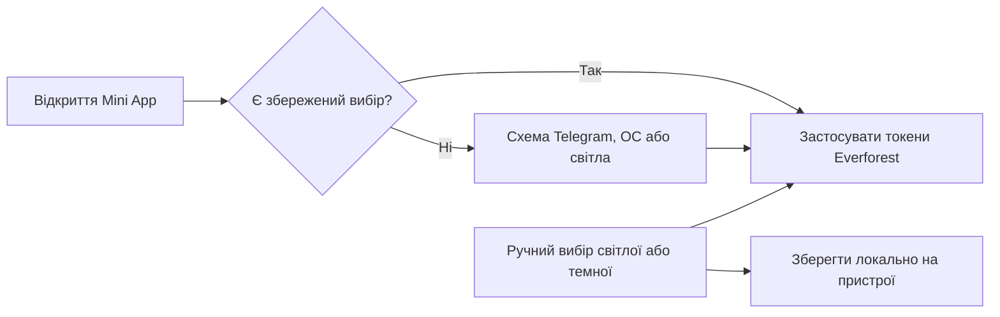
```mermaid
flowchart LR
    Open[Відкриття Mini App] --> Saved{Є збережений вибір?}
    Saved -->|Так| Apply[Застосувати токени Everforest]
    Saved -->|Ні| Initial[Схема Telegram, ОС або світла]
    Initial --> Apply
    Manual[Ручний вибір світлої або темної] --> Apply
    Manual --> Store[Зберегти локально на пристрої]
```

Некоректне значення сховища прирівнюється до відсутнього. Недоступне сховище не блокує перемикання в поточному запуску; після ручного вибору themeChanged не змінює тему. Навчальний стан і введена відповідь зберігаються. Серверного запиту для вибору теми немає (AC-58).

**Flags:**
- `message-bus` у потоці «Content report і автоматична звірка» реалізує черга задач у PostgreSQL з пропуском заблокованих рядків (ADR-0011), окремого брокера §5 не має — уточнити в `generate-data-model`.
- Учасники підписані `user`, `ui`, `service`, `data-store`, `external-system`, `message-bus`, `client` без кутових дужок, щоб рендерер Mermaid не прибрав їх як HTML-теги.
- Дві чорнові діаграми від `architecture-design` (`Critical flow 1`, `Critical flow 2`) лишено без змін; вони використовують конкретні назви контейнерів.
- Після другого `clarify-prd` (2026-10-31) потоки оновлено вручну під AC-46…AC-55 і US-12; додано потік «Відкат застосованої зміни словника», а `Critical flow 2` переписано під відкладене нагадування з AC-26.

## 7. Deployment view

Один образ Docker: multi-stage збірка спершу будує Mini App (Node 22), копіює її в `wwwroot`, потім публікує бекенд; build context розширюється до кореня репозиторію. У k8s — один Deployment з `replicas: 1` і PostgreSQL; Mini App і API обслуговуються з одного HTTPS-домену, який також є адресою webhook. Фонові тики (нагадування, дайджести, звірка) працюють у тому самому процесі.

**Monitoring:**
- Зовнішній сервіс перевіряє доступність публічного health endpoint раз на хвилину й надсилає сповіщення власнику після трьох послідовних невдалих перевірок. Це єдиний активний сигнал моніторингу доступності в пілоті.
- Журнал відправлень (`notification_dispatch`) — частка відправлень, надісланих у межах 2 хв від `due_at_utc`.
- Серверні метрики latency для оцінки відповіді й пошуку; клієнтська телеметрія відкриття «Сьогодні» через окремий endpoint (`navigator.sendBeacon`).
- Щоденна звірка журналу відповідей із картками session.

**Scaling thresholds:**
- Пілот: ~50 learner, ціль ≥ 100 одночасних на одному екземплярі.
- Друга репліка вимагає: міграцій поза стартом застосунку (bundle або init-контейнер); Quartz-тики безпечні завдяки захопленню рядків з пропуском заблокованих.
- Обсяг: 2 000 лем × десятки форм — сотні тисяч рядків таблиці форм; журнал відповідей пілоту — десятки тисяч подій.

**Обов'язкові виправлення до пілоту** (з `architecture-map.md` §Constraints): probes на `api/telegram/health`; рядок підключення через `ConnectionStrings__DefaultConnection`; webhook не видаляється на зупинці.

## 8. Crosscutting concepts

| Concept | Convention | Where defined |
|---|---|---|
| Logging | Структуровані шаблони `ILogger` з `{LearnerId}` замість `{ChatId}`; заголовок `Authorization` і `initData` ніколи не логуються | тут; `architecture-map.md` §Conventions |
| Authentication | `AuthenticationHandler` перевіряє `initData` (HMAC-SHA256, свіжість `auth_date` ≤ 24 год) у кожному запиті | ADR-0005 |
| Authorization | Policy `ContentEditor` з claim, який додає `IClaimsTransformation` за списком Telegram id у конфігурації (secret); `learner_id` лише з claims, чужі ресурси — «не знайдено» | тут (рішення OQ-3) |
| Псевдонімна мітка автора | Випадковий alias на кшталт `R-7F3A9C`, унікальний, зберігається в learner при першому content report | тут (PRD §6.1) |
| Error handling | ProblemDetails через `[ApiController]`; доменні відмови — бізнесові повідомлення українською; webhook завжди відповідає успіхом, помилки лише логуються | тут |
| API style | REST JSON на контролерах `[ApiController]` усередині модулів, `AddOpenApi()`; TS-типи клієнта генеруються з OpenAPI | тут; `api-forge` |
| Idempotency | Картка session — природний ключ відповіді: захоплення `pending → answered` у тій самій транзакції, що й запис відповіді; повтор з тим самим вмістом повертає збережений результат, з іншим — відмову без зміни результату | ADR-0008 |
| Concurrency | Оптимістична конкурентність через `xmin` на стані слова й session; унікальні `learner_word(learner_id, entry_id)` і одна активна session на learner у межах доби | тут |
| Time | NodaTime: `IClock`, IANA tzdb, `LocalDate` доби learner; тести з `FakeClock` | ADR-0006 |
| Answer evaluation | Чистий доменний сервіс: NFC, обрізання й стискання пробілів, нижній регістр, без кінцевих `. , ! ? ; : …`, кириличні двійники `а е і о р с у х` → латиниця; явна мапа згортання діакритики (`ą ć ę ł ń ó ś ź ż`); синонім з іншого запису — нейтральний результат `synonym`; структурований diff з сервера | тут (AC-12–AC-17, AC-56, AC-57) |
| ID strategy | UUID v7, генерується застосунком (`Guid.CreateVersion7()`) — дефолт курсу для нової схеми, старі `int`-таблиці видаляються (ADR-0004); Telegram user id — `long` з унікальним індексом | `data-model.md` |
| UI / design system | `@telegram-apps/telegram-ui` із токенами Everforest; світла/темна тема, ручний вибір у localStorage, Telegram лише початкове джерело схеми; lazy-чанки для словника, налаштувань і черги редактора | [design-system.md](./design-system.md), ADR-0013 |
| Data fetching | TanStack Query: кеш `/today`, відміна застарілих запитів пошуку, повтор мутацій з тим самим ключем картки | тут |
| Search UX | Запит на кожен символ без debounce, відміна застарілого запиту, `CancellationToken` до EF-запиту | ADR-0012, AC-30 |
| Bot webhook | `SetWebhook` з `secret_token` і перевіркою заголовка; явні `allowed_updates`; без видалення на зупинці; заблокований бот вимикає нагадування | тут |
| Internationalisation | Інтерфейс українською; польські тексти — контент словника | — |
| Observability | Журнал відправлень, серверні latency-метрики, клієнтська телеметрія «Сьогодні» | §7 |

## 9. Architecture decisions

| # | Title | Status | Section |
|---|---|---|---|
| 0001 | Deliver the trainer as a backend service plus a Telegram Mini App | Accepted | §4 |
| 0002 | Build the Mini App as a React SPA served by ASP.NET Core | Accepted | §4 |
| 0003 | Organise code into feature modules inside the monolith | Accepted | §5 |
| 0004 | Retire the group model without data migration | Accepted | §4 |
| 0005 | Authenticate every API request with Telegram initData | Accepted | §8 |
| 0006 | Model learner time with NodaTime and IANA zones | Accepted | §8 |
| 0007 | Dispatch notifications through a Postgres dispatch table | Accepted | §6 |
| 0008 | Keep the learning session server-side with per-card idempotency | Accepted | §6 |
| 0009 | Schedule reviews with MEMORIZE behind a port over an answer log | Accepted | §4 |
| 0010 | Version dictionary entries in Postgres with a published pointer | Accepted | §4 |
| 0011 | Verify content reports asynchronously against reference snapshots | Accepted | §4 |
| 0012 | Search via a precomputed table of folded word forms | Accepted | §8 |
| 0013 | Використовувати Everforest із ручним вибором світлої та темної теми | Accepted | §4, §6, §8 |

ADR files live under `docs/features/personal-trainer-mvp/adr/NNNN-<title>.md`.

## 10. Quality requirements

**QG-1. Коректність навчального обліку**
- **When:** learner надсилає ту саму відповідь двічі (подвійне натискання, повтор після мережевої помилки) або двома пристроями.
- **Then:** 0 втрачених відповідей; повторне надсилання тієї самої відповіді зараховується один раз (PRD §6).
- **How verify:** інтеграційний тест подвійного надсилання на справжньому PostgreSQL (Testcontainers) + щоденна звірка журналу відповідей із картками session.

**QG-2. Чутливість інтерфейсу**
- **When:** learner відкриває trainer, відповідає на вправу або вводить символ у пошуку при ≥ 100 одночасних learner на одному екземплярі.
- **Then:** Latency p95 відкриття екрана «Сьогодні» ≤ 1 500 ms; оцінки відповіді ≤ 500 ms; пошуку в словнику ≤ 300 ms на запит (PRD §6).
- **How verify:** навантажувальний тест перед пілотом; клієнтська телеметрія «Сьогодні»; серверні метрики оцінки відповіді й пошуку.

**QG-3. Надійність нагадувань**
- **When:** настає час нагадування learner, зокрема після рестарту застосунку чи зміни часового поясу.
- **Then:** ≥ 99% нагадувань надіслано в межах 2 хв від запланованого часу; не більше одного нагадування на календарну дату learner (PRD §6, AC-26, AC-44).
- **How verify:** журнал доставки з тижневим вікном; тести planner на перехід DST і зміну поясу з `FakeClock`.

**QG-4. Доступність**
- **When:** будь-який місяць пілоту.
- **Then:** Availability 99.5% (PRD §6).
- **How verify:** місячне вікно обчислюється за зовнішніми перевірками health endpoint раз на хвилину; три послідовні невдалі перевірки створюють сповіщення власнику.

## 11. Risks and technical debt

| Risk / debt | Severity | Mitigation | Owner |
|---|---|---|---|
| Ліцензія VESUM (CC BY-NC-SA 4.0) забороняє комерційне використання українських словоформ і може поширити ShareAlike на таблицю форм | High | До генерації форм вибрати: VESUM для некомерційного пілоту з атрибуцією, hunspell `uk_UA` після перевірки ліцензій файлів або пошук лише за базовими формами | Viacheslav Melnichenko |
| Немає машинного польсько-українського словника з відкритою ліцензією, крім Wikisłownik, — «другий словник» з AC-35 фактично недоступний | Medium | Автопідтвердження перекладу лише за Wikisłownik; решта йде content editor; частку автопідтверджень вимірювати на пілоті | Viacheslav Melnichenko |
| Умови використання WSJP PAN невідомі | Medium | Лише точкові запити з обмеженням частоти до перевірки умов; без масового скрейпінгу | Viacheslav Melnichenko |
| Парсер вікітексту Wikisłownik і конвертер IPA → кирилиця крихкі | Medium | Окремі адаптери за портом `IReferenceSource` з тестами на зразках; збій парсера переводить звірку в ручний режим | Backend |
| `@telegram-apps/telegram-ui` фіксує проєкт на React 18 і розвивається повільно | Low | Семантичні токени Everforest відокремлені від kit; адаптер компонентів перевіряється в обох темах, kit можна замінити поступово | Frontend |
| Наявність `tzdata` та ICU в образі `aspnet:10.0` не перевірена | Medium | Перевірити під час скафолдингу; NodaTime несе власну tzdb | Backend |
| Інтерфейс недоступний під час рестарту, бо UI й API в одному процесі | Low | Один короткий рестарт на реліз; webhook більше не видаляється на зупинці | Backend |
| Немає процесу перевірки в реальному клієнті Telegram | Medium | Тестовий бот і HTTPS-тунель для ручної перевірки; `mockTelegramEnv` для локальної розробки | Frontend |

**Закриті відкриті питання:**
- Поле прийнятих польських варіантів — таблиця `version_accepted_answers` (`data-model.md`).
- Активність learner менше 30 хв тому в час reminder — нагадування відкладається, а не пропускається (PRD AC-26).
- Синоніми, кирилиця й пунктуація у відповіді — PRD OQ-5 закрито через AC-56, AC-57 і правило нормалізації.
- Вікно дії «Моя відповідь теж правильна» — поки показано результат картки, до переходу на наступну або кінця доби learner (PRD AC-17).

**Accepted debt (acceptable in v1, plan to fix later):**
- Межі модулів тримаються на домовленості й архітектурному тесті, а не на окремих збірках.
- Нагадування мають семантику «не більше одного»: збій між надсиланням і позначкою втрачає нагадування, і це йде в бюджет 1% NFR.
- Параметри MEMORIZE апріорні до перенастроювання за даними пілоту (PRD OQ-4).
- Один екземпляр і автоміграції на старті; друга репліка потребує змін з §7.
- Окремий security review відсутній; безпекові ризики покриваються лише запланованими автоматизованими тестами.
- Перевірки Mini App і наскрізні E2E не запускаються в CI; їх виконують локально. Ручна перевірка в Telegram обмежена одним smoke test перед пілотом.

## 12. Glossary

Канонічні терміни — у [CONTEXT.md](../../../CONTEXT.md). Тут лише архітектурні терміни цього SAD.

| Term | Meaning |
|---|---|
| initData | Підписані Telegram дані запуску Mini App з ідентичністю користувача й `auth_date` |
| Dispatch table | Таблиця запланованих відправлень бота з унікальним ключем `(recipient, kind, local_date)` |
| Answer log | Append-only журнал подій відповідей — джерело істини, з якого перебудовується стан слів |
| Published pointer | Посилання запису словника на поточну `approved`-версію, яку бачать learner |
| Folded form | Словоформа після нормалізації й згортання діакритики для префіксного пошуку |
| Reference snapshot | Локальна копія довідкових даних (дамп Wikisłownik, кеш точкових запитів) для звірки |
